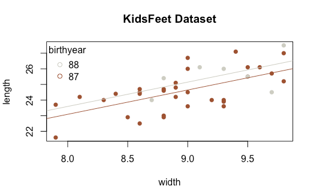

```{r, include=FALSE}
# Be sure to run these in your console as well:

library(alr3)
library(car)
library(party)
library(lmtest)
library(MASS)
library(mosaic)
```

<!-- Place your answer to each question in the curly brackets
     For example:
     
     # Question 1 {a}
     # Question 2 {b}
     # Question 3 {c} 
     
     Submit your completed exam to the I-Learn dropbox:
       Final Exam: Final Attempt 
     for final grading.
     
     Note: you can submit the file once before it is officially graded 
     and get feedback about how many questions are correct, if you want.
     
     Just use the "First Attempt" dropbox in I-Learn. -->


## Question 1 {a}

Consider the linear model $Y_i = \beta_0 + \beta_1 X_i + \epsilon_i$ where $\epsilon_i \sim N(0,\sigma^2)$. Which of the following is a true statement about this model?

(a) $\beta_0 + \beta_1 X_i$ describes the functional relationship of the data to the true model.

(b) $\epsilon$ describes the average value of $Y_i$ for given values of $X_i$.

(c) A small value for $\sigma$ results in a very low value of $R^2$.

(d) The model is purely statistical and does not contain any functional relations.


## Question 2 {a}

Use the `KidsFeet` dataset to perform a regression where $Y$ represents the length of a child's foot and $X$ represents the width of the foot.

State your obtained equation for $\hat{Y_i}$.

```{r}
summary(lm(length ~ width, data=KidsFeet))
```


(a) $\hat{Y_i} = 9.8172 + 1.6576 X_i$

(b) $\hat{Y_i} = 1.6576 + 9.8172 X_i$
	
(c) $\hat{Y}_i = 0.00192 + 9.8172 X_i$
	
(d) $\hat{Y}_i = 1.6576 + 0.00192 X_i$


## Question 3 {b}

In the previous question, you were instructed to "use the `KidsFeet` dataset to perform a regression where $Y$ represents the length of a child's foot and $X$ represents the width of the foot."

Check the appropriateness of this regression. There is one assumption that appears to be violated, all other seem fine.

Which assumption shows evidence of being violated?

```{r}
plot(length ~ width, data=KidsFeet)
plot(lm(length ~ width, data=KidsFeet),which=1:2)
```


(a) Linear relation between $Y$ and $X$.
	
(b) Normality of the error terms.
	
(c) Constant variance of the error terms.  
	
(d) Independent error terms.


## Question 4 {d}

A multiple linear regression is performed to understand infant growth in height in inches as they age from 9 to 36 months old. The model selected is

$$
  \underbrace{Y_i}_{height} = \beta_0 + \beta_1 \underbrace{X_{i1}}_{age} + \beta_2 \underbrace{X_{i2}}_{gender} + \beta_3 X_{i1}X_{i2} + \epsilon_i
$$

where gender is 0 for males and 1 for females and the following summary results obtained in R.

Coefficients:

| &nbsp;    |	Estimate	  | Std. Error	| t value  | Pr(>|t|) |
|-----------|-------------|-------------|----------|----------|
|(Intercept)|	28.132      |	4.9118      | 2.226	   | 0.03258 *|
| age	      | 2.7272	    | 0.5339      |	2.889    | 0.00659 **|
| genderFemale	| -0.2856 |	6.6054	    | -0.179	 | 0.85858 |
| age:genderFemale	| 0.1170|  	0.7328	|  0.160	 | 0.87410 |

This model claims how many inches of growth per month, on average, for females between the ages of 9 and 36 months?

(a) 2.4416
	
(b) 0.1170
	
(c) 2.7272
	
(d) 2.8442


## Question 5 {c}

Use the RailTrail dataset to perform the multiple linear regression that would produce the graph shown.

What is the equation of the Spring/Fall line?

```{r}
RT.lm <- lm(volume ~ hightemp + summer + hightemp:summer ,data=RailTrail)
summary(RT.lm)
```


(a) $\underbrace{\hat{Y}_i}_{\tiny volume} = 102 + 2.2 \underbrace{X_i}_{\tiny hightemp}$

	
(b) $\underbrace{\hat{Y}_i}_{\tiny volume} = -144 + 9.9 \underbrace{X_i}_{\tiny hightemp}$
	
(c) $\underbrace{\hat{Y}_i}_{\tiny volume} = -232 + 9.3 \underbrace{X_i}_{\tiny hightemp}$
	
(d) $\underbrace{\hat{Y}_i}_{\tiny volume} = -252 + 8.8 \underbrace{X_i}_{\tiny hightemp}$


## Question 6 {b}

What is the value of SSE according to the output shown below?

```{}
Coefficients:
            Estimate Std. Error t value Pr(>|t|)    
(Intercept)  6.62059    0.54932  12.052 3.66e-11 ***
slope       -0.03895    0.05439  -0.716    0.481    
---
Signif. codes:  0 ‘***’ 0.001 ‘**’ 0.01 ‘*’ 0.05 ‘.’ 0.1 ‘ ’ 1

Residual standard error: 1.875 on 22 degrees of freedom
Multiple R-squared:  0.02278,	Adjusted R-squared:  -0.02163 
F-statistic: 0.5129 on 1 and 22 DF,  p-value: 0.4814
```
	
(a) 38.9
	
(b) 77.3
	
(c) 1.9
	
(d) 25.2


## Question 7 {d}

Consider the regression output below. What is the value of the semi-studentized residual for a residual of $e_i = 3.8$?

```{r, echo=FALSE, evel=FALSE}
#summary(lm(S ~ C, data=cloud))
```
	
(a) 1.937
	
(b) 8.360
	
(c) 0.525
	
(d) 4.054


## Question 8 {c}

A researcher develops a multiple regression model to predict the highway miles per gallon of a vehicle based on the city miles per gallon of the vehicle. They run the following codes to do this.

```{r, eval=FALSE}
?mpg
View(mpg)

plot(hwy ~ cty, data = mpg)
mpg.lm <- lm(hwy ~ cty, data=mpg)
plot(mpg.lm$residuals ~ cyl, data=mpg)
plot(mpg.lm$residuals ~ displ, data=mpg)
boxplot(mpg.lm$residuals ~ drv, data=mpg)
```

The researcher is wondering if their model would be improved by including a second explanatory variable. 


They are considering whether they should add (A) the number of cylinders of the vehicle, (B) the the drive type of the vehicle, or (C) the displacement of the vehicle to the model. 

(a) They should add the `number of cylinders` of the vehicle.
	
(b) The should add the `displacement` of the vehicle.

(c) They should add the `drive type` of the vehicle.
	
(d) None of these options would add anything useful to the model.


## Question 9 {c}

Select the plot below that correctly depicts the least squares regression line for the data shown.

(a) 
	
(b) 
	
(c) 
	
(d) 


## Question 10 {c}

Which of the following provides the correct form and distribution of the test statistic for testing $H_0: \beta_2 = \beta_3 = 0$ against the alternative that $H_a: \beta_j \neq 0$ for at least one $j \in \{2,3\}$ in the regression model 

$$
  Y_i = \beta_0 + \beta_1 X_{i1} + \beta_2 X_{i2} + \beta_3 X_{i1}X_{i2} + \epsilon_i
$$

where $\epsilon_i \sim N(0,\sigma^2)$.

(a) $t = \frac{b_1 - \beta_{10}}{s\{b_1\}}$ where $t \sim t(n-2)$
	
(b) $t = \frac{b_1 - \beta_{10}}{s\{b_1\}}$ where $t \sim t(n-3)$
	
(c) $F = \frac{SSE(R) - SSE(F)}{df_R - df_F}\div\frac{SSE(F)}{df_F}$ where $df_R=n-2$ and $df_F=n-4$
	
(d) $F = \frac{SSE(R) - SSE(F)}{df_R - df_F}\div\frac{SSE(F)}{df_F}$ where $df_R=n-1$ and $df_F=n-2$


## Question 11 {Xc}

What is the p-value for the missing entry in the output below? Note: the sample size for this regression was $n=30$.

```{}
Coefficients:
                  Estimate Std. Error t value Pr(>|t|)
(Intercept)        389.075    374.182   1.040    0.308
X1                  -6.171     51.379  -0.120    0.905
X2                -109.736    374.404       ?        ?
X1:X2                9.468     51.428   0.184    0.855
```

```{r}
-109.736/374.404
pt(-109.736/374.404, 30, lower.tail = TRUE)*2
```


(a) $t = -0.293$ and $p = 0.7718$
	
(b) $t = -3.45$ and $p = 0.00169$
	
(c) $t = -0.293$ and $p = 0.7715$
	
(d) $t = -3.45$ and $p = 0.00167$


## Question 12 {b}

The following regression was performed in R. The graphic of the regression and the corresponding lm( ) output from the regression is shown.

What is the y-intercept and slope of the line for Tree #2?


(a) Y-intercept = 24.43785     Slope = 0.0435846
	
(b) Y-intercept = 19.9609       Slope = 0.1250618
	
(c) Y-intercept = 24.43785      Slope = 0.08147716
	
(d) Y-intercept = 19.9609       Slope = -4.476943


## Question 13 {a}

Suppose the regression model
$$
  \underbrace{Y_i}_{\text{length}} = \beta_0 + \beta_1 \underbrace{X_{i1}}_{\text{width}} + \beta_2 \underbrace{X{i2}}_{byear=88} + \epsilon_i
$$

is used to model the KidsFeet dataset in R using this code, which you should run in R:

```{r}
kids.lm <- lm(length ~ width + as.factor(birthyear), data=KidsFeet)
summary(kids.lm)
```

The regression is drawn as follows.



Which of the following correctly interprets the results of this regression?

(a) Because the p-value for the $\beta_2$ term is not significant, the two lines should really just be one line.
	
(b) Because the p-value for the $\beta_1$ term is significant, the slope of the lines should be different.
	
(c) Because the p-value for the $\beta_0$ term is significant, the y-intercepts of the two lines are different.
	
(d) Because the p-value for the $\beta_2$ term is not significant, the slopes of the two lines are the same.
	


## Question 14 {dX}

Suppose you are asked to help decide how wide (in centimeters) kid's shoes should be for **boys** with foot lengths of 25 centimeters. Suppose further you are provided with the KidsFeet dataset. Perform a regression that would help provide an answer to this question.

Select the interval below that, according to our regression, should contain 95% of the widths of boy's feet that are 25 centimeters long.

```{r}
plot(width ~ length, data=KidsFeet, col=KidsFeet$sex)
lmKF<-lm(width ~ length, data=KidsFeet)
summary(lmKF)
predict(lmKF, data.frame(length=25), interval="predict")
```

	
(a) (8.929496 cm, 9.192444 cm)
	
(b) (8.34834 cm, 9.987009 cm)
	
(c) (8.988215 cm, 9.347134 cm)
	
(d) (8.247227 cm, 9.874713 cm)

## Question 15 {b}

Use the Orange dataset in R to perform a linear regression of the circumference (y) of an orange tree according to the age of the tree (x).

Which regression assumption is not satisfied for this regression?

```{r}
lmO <- lm(circumference ~ age, data=Orange)
summary(lmO)
plot(lmO, which=1:2)
```


(a) The relationship of Y and X does not appear to be linear.
	
(b) The variance of the error terms does not appear to be constant.
	
(c) The X-values do not appear to be considered as fixed values in this regression.
	
(d) The error terms of the regression do not appear to be normal.


## Question 16 {b}

Select the answer that correctly describes the lines on the scatterplot shown.

```{r}
plot(dist ~ speed, data=cars)
abline(lm(dist ~ speed, data=cars))
abline(rlm(dist ~ speed, data=cars), col="red")
```


(a) Line A is the robust regression line and line B is the OLS regression line.
	
(b) Line B is the robust regressionline and line A is the OLS regression line.
	
(c) Line A is the OLS regression line, but the robust regression line actually goes above line A, not below it.
	
(d) Line B is the OLS regression line, but the robust regression line actually goes below line B, not above it.


## Question 17 {d}

Use the fabricated Burt dataset from library(car) to perform a regression of IQbio (Y) and IQfoster (X). Notice how beautiful the regression is, which isn't surprising because it was revealed after the data was published that it had been fabricated.

Which of the following is the correct interpretation of this regression model?

```{r}
summary(lm(IQbio ~ IQfoster,data=Burt)) 
plot(IQbio ~ IQfoster,data=Burt)
```


(a) The data claims the average IQ of a biologically raised twin is about 9 points lower when the IQ of their corresponding foster raised twin is zero.
	
(b) The data claims the average IQ of a biologically raised twin is about 9% of the IQ of their corresponding foster raised twin.
	
(c) The data claims the average IQ of a biologically raised twin is about 9 times greater than the IQ of their corresponding foster raised twin.
	
(d) The data claims the average IQ of a biologically raised twin is about 90% of the IQ of their corresponding foster raised twin, plus about 9 points.


## Question 18 {a}

Which of the following best describes SSR?

(a) A measure of how much the regression line differs from the $\bar{y}$ line.
	
(b) A measure of how much the residuals differ from the regression line.
	
(c) A measure of how much the response variable differs from the mean.
	
(d) A measure of how much the estimated regression line differs from the true regression line.


## Question 19 {c}

Run the following code in R:

```{r}
us.lm <- rlm(Assault ~ UrbanPop + Murder + Rape, data=USArrests)
par(mfrow=c(1,2))
plot(us.lm, which=1)
plot(us.lm, which=4)
us.lm$wresid
```

Of the possible outlying points of North Carolina, Deleware, and Hawaii, which has the least influence on the regression line?

(a) North Carolina
	
(b) Delaware
	
(c) Hawaii
	
(d) Georgia


## Question 20 {b}

Consider transforming $Y$ in the regression of stopping distance on speed using the `cars` dataset in R. Which of the following shows the "best" $Y$ transformation possible for this data in the original units?


(a) A
	
(b) B
	
(c) C
	
(d) D


## Question 21 {dX}

Which transformation would be the best option for the data shown?

```{r}
Lob.lm <- lm(height ~ age, data=Loblolly)
plot(height ~ age, data=Loblolly)
abline(Lob.lm)

boxCox(Lob.lm)
```

(a) $X' = \sqrt{X}$
	
(b) $X' = X^{0.3}$
	
(c) $Y' = Y^{0.3}$
	
(d) $Y' = \sqrt{Y}$


## Question 22 {b}

Consider the "best tranformation" regression of "dist ~ speed" that you performed in Question 20. Use this "best transformation" model to estimate the distance it would take a 1920’s vehicle to come to a complete stop when traveling at a speed of 25 mph using 99% confidence. Be sure to write your answer in the original units.

```{r}
plot(dist ~ speed, data=cars)
lmcar<-lm(dist ~ speed, data=cars)
abline(lmcar)
summary(lmcar)

plot(I(dist^.5) ~ speed, data=cars)
lmcarT<-lm(I(dist^.5) ~ speed, data=cars)
abline(lmcarT)
summary(lmcarT)
b<- lmcarT$coefficients
curve((b[1] + b[2]*x)^2,add=TRUE)
predict(lmcarT, data.frame(speed=25), level=.99, interval = "prediction")^2

```


(a) Between 48.5 feet and 113.0 feet.
	
(b) Between 39.1 feet and 154.3 feet.
	
(c) Between 80.1 feet and 81.2 feet.
	
(d) Between 37.7 feet and 123.7 feet.


## Question 23 {c}

Which regression model gives the highest adjusted $R^2$ for the following scatterplot?

```{r}
plot(HT18 ~ HT2, data=BGSboys, xlab="2-Year Old Height", ylab="18-Year Old Height")
summary(lm(HT18 ~ HT2,data=BGSboys))
summary(lm(I(HT18^2) ~ HT2,data=BGSboys))
summary(lm(HT18 ~ I(log(HT2)),data=BGSboys))
summary(lm(HT18 ~ I(HT2^.5),data=BGSboys))

```

(a) A simple linear regression of the 18-year old height on the 2-year old height.
	
(b) A simple linear regression of the square of 18-year old height on the 2-year old height.
	
(c) A simple linear regression of the 18-year old height on the log of 2-year old height.
	
(d) A simple linear regression of the 18-year old height on the square root of the 2-year old height.


## Question 24 {b}

Consider the data shown in the colored scatterplot below.

```{r}
palette(c("skyblue","firebrick"))
BGS <- rbind(BGSboys,BGSgirls)
plot(HT18 ~ HT2, data=BGS, col=as.factor(Sex), pch=Sex+5,
     xlab="2-Year Old Height", ylab="18-Year Old Height")
legend("topleft", legend=c("Boys","Girls"), pch=c(5,6), col=palette(), bty='n')
```

```{r}
summary(lm(HT18 ~ HT2, data=BGS))
summary(lm(HT18 ~ HT2 + Sex, data=BGS))
summary(lm(HT18 ~ HT2 + Sex + HT2:Sex, data=BGS))
summary(lm(HT18 ~ HT2 + HT2:Sex, data=BGS))
```


Which lm(...) is best for these data?

(a) lm(HT18 ~ HT2, data=BGS)
	
(b) lm(HT18 ~ HT2 + Sex, data=BGS)
	
(c) lm(HT18 ~ HT2 + Sex + HT2:Sex, data=BGS)
	
(d) lm(HT18 ~ HT2 + HT2:Sex, data=BGS)


## Question 25 {c}

Test the following hypotheses for a regression of `length ~ birthmonth` using the `KidsFeet` dataset.

$$
  H_0: E\{Y_i\} = \beta_0 + \beta_1 X_i
$$
$$
  H_a: E\{Y_i\} \neq \beta_0 + \beta_1 X_i
$$
```{r}
lmK <- lm(length ~ birthmonth, data=KidsFeet)
pureErrorAnova(lmK)
```


Report the p-value of your test.

(a) 0.0003365
	
(b) 0.9855
	
(c) 0.8196
	
(d) 0.9864
